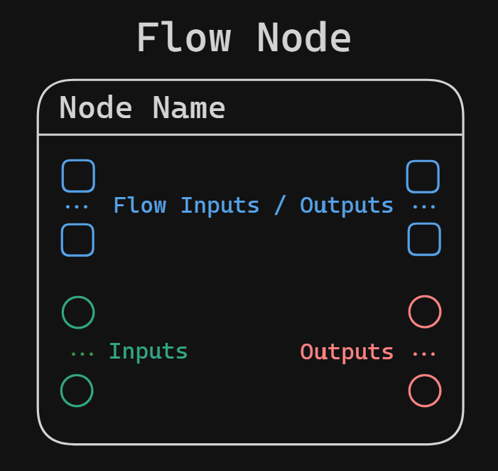

**Flow interpretation** results in a sequence of root nodes, that are supposed to be interpreted sequentially. Each node in the sequence is, in fact, a root of a node tree, which this node depends on. To resolve the sequence, you would need to sequentially resolve root nodes, that, in their turn, require recursive resolution of descending branches.

*Real example: Unreal Engine's Blueprints.*

```cpp
Node Sequence = {

Node_1:
	Node_2
	Node_3
	Node_4:
		Node_5

Node_6
Node_7:
	Node_8:
		Node_9
		
Node_10

}
```

Flow Interpretation nodes, that are structured in a sequence, generally look like this:
<p align="center">
  
</p>
Each node of the sequence must have a *Flow Input* and a *Flow Output* pin (exceptions to this rule are "border" nodes that only have one Flow pin: input or output). Such nodes can have as many secondary input and output pins. Inputs can come from either node trees, that branch out from this flow node, or from outputs of other flow nodes (output values are usually cached, so they can be used by the following nodes).

Nodes that branch out from Inputs are the same as nodes in ***Hierarchical Interpretation***.