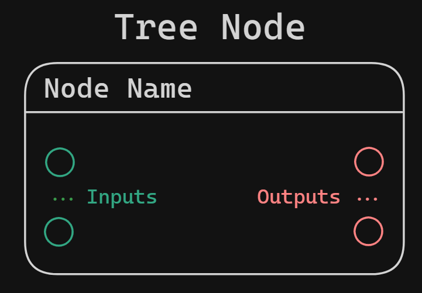

**Hierarchical node interpretation** results in a hierarchical structure (a tree), where to resolve the root node, you would need to recursively resolve nodes from descending branches.

Hierarchical node interpretation is primarily designed for systems that directly reflect node structure into **code** (in an arbitrary language) using macro-like unwrapping. That said, runtime evaluation of the node tree is still possible and useful in specific situations.

*Real example: Blender's Shader Nodes.*

*NOTE: Missing inputs are marked as NONE (or `nullptr` on C++ side)*

Hierarchical interpretation requires one of the two following node formats:

  

Each node can have as many *Input* pins, but only one *Output* pin.
